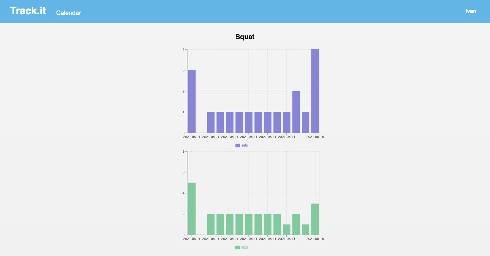

# Chalisthenics track

> An app to track your progress for chalisthenics routine. 

    

## Built With

- [create-react-app](https://create-react-app.dev/)
- [React](https://reactjs.org/)
- [Redux](https://redux.js.org/)

## Live Demo

[https://chalisthenics-tracker.herokuapp.com/](https://chalisthenics-tracker.herokuapp.com/)

## Getting Started

To get a local copy up and running follow these simple example steps.

### Prerequisites

Make sure you have installed [Node JS](https://nodejs.org/en/). If not, follow this [guide](https://www.geeksforgeeks.org/installation-of-node-js-on-linux/) for Linux or this [one](https://treehouse.github.io/installation-guides/mac/node-mac.html) for Mac OS.

### Setup

Download the project

    $ git clone https://github.com/fivan18/react-redux-tracker.git

Install the dependencies

    $ npm install

### Install

To modify the code and see the changes on live go to the project's root directory and run:

    $ npm start

### Usage

Open the next link [http://localhost:3000/](http://localhost:3000/).

### Run tests

[React Testing Library](https://testing-library.com/docs/react-testing-library/intro/) has been used to test the project. Run the next command:

    $ npm test

### Deployment

To deploy this project on heroku follow the next [instructions](https://github.com/mars/create-react-app-buildpack).

## Authors

👤 **Ivan Ulises Guzman Sanchez**

- Github: [@fivan18](https://github.com/fivan18)
- Twitter: [@fivanunam](https://twitter.com/fivanunam)
- Linkedin: [fivan](https://www.linkedin.com/in/fivan)

## Contributing

Contributions, issues and feature requests are welcome!

Feel free to check the [issues page](https://github.com/fivan18/react-redux-tracker/issues).

## Show your support

Give a ⭐️ if you like this project!

## Acknowledgments
- Design Idea by [Gregoire Vella](https://www.behance.net/gregoirevella) 
